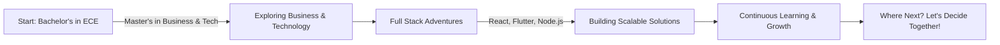

<h1 align="center">Hi 👋, I'm Chandra Vamshi Dasyam</h1>
<h3 align="center">FullStack Developer based in Germany</h3>

# 👨‍💻 Chandra Vamshi: Crafting the Future, One Line of Code at a Time

Welcome to my digital playground! 🌟 I'm Chandra, a Berlin-based Full Stack Developer with a penchant for transforming ideas into digital realities. With over 5 years of weaving code into solutions, I thrive on the brink of innovation, exploring new technologies to create web and mobile experiences that resonate.

## 🚀 My Journey

### 📚 From Theory to Action

- **Educational Foundation**: Grounded in electronics, expanded through business, and specialized in information and communication technology.
- **Professional Evolution**: From trainee to full-stack expert, my path reflects a relentless pursuit of growth and excellence.

## 🌟 What Makes Me Unique and Why I Stand Out

- **Tech Agnostic**: Fluent in multiple languages (Node.js, TypeScript, PHP) and frameworks (Angular, React, Flutter), always picking the best tool for the job.
- **DevOps Enthusiast**: Skilled in Docker, Kubernetes, and AWS, ensuring smooth, scalable deployments.
- **Agile Advocate**: Agile not just in development methodology but as a mindset, adapting quickly to change and focusing on continuous improvement.

## 🎨 Featured Projects

Here's a glimpse into my portfolio, showcasing projects where creativity meets functionality:

- **Interactive Web Platform** [React, Redux]: A dynamic web application enhancing user engagement through intuitive design and responsive architecture.
- **Cross-Platform Mobile App** [Flutter]: A seamless mobile experience, delivering consistency across devices with a single codebase.

## 📈 Stats & Streaks

## 💡 Let's Innovate Together

I'm on a quest for the next challenge, the next solution, the next big thing. Got an idea? I'd love to hear it. Let's turn the impossible into the inevitable. Together, we can build the future.

- 📩 **Reach Out**: [Drop me a line](mailto:dasyamchandravamshi@gmail.com)
- 🔗 **LinkedIn**: [Let's connect](https://www.linkedin.com/in/chandravamshi/)

---

This README profile is not just a summary of skills and experiences but a canvas that reflects your professional identity. It invites the viewer on a journey, showcases your evolution, and leaves a memorable impression with its visual and narrative elements. Feel free to adjust the content and layout to better reflect your personality and professional trajectory.

- 📫 How to reach me  dasyamchandravamshi@gmail.com

<h2 align="left">Skills</h2>

 
<h3 >Languages:</h3>
    
    
 

 
<h3 >Mobile App:</h3>
  
  
 

 
 
<h3 >Frameworks/Libraries:</h3>
  
       
 

 
 
<h3 >Databases:</h3>
     
   
 

  
 
 <h3 >Backend as a Service:</h3>
     
 

 
 
<h3 >Devops:</h3>
    
    
  

<h3 align="left">Other Softwares or Tools:</h3>

 
 
     

  

<!--
  

 -->

<!--

&nbsp;

 -->
<!--

 -->
